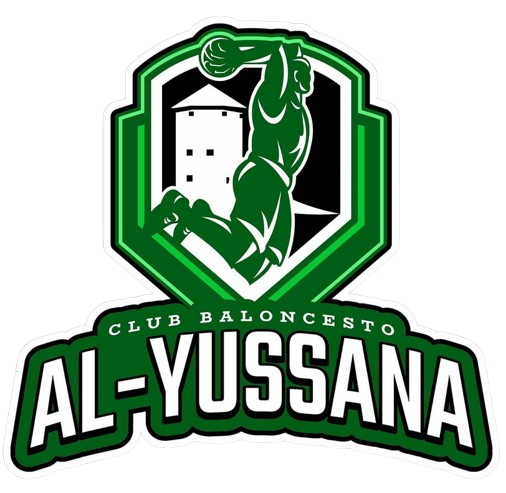

# CB Al-Yussana Web

Bienvenido al repositorio de la web oficial del equipo de baloncesto CB Al-Yussana. Este proyecto tiene como objetivo proporcionar una plataforma en línea donde los seguidores y miembros del club puedan acceder a información relevante sobre el equipo, eventos, merchandising y mucho más.

## Tecnologías Utilizadas

Este proyecto ha sido desarrollado utilizando las siguientes tecnologías:

- **React**: Biblioteca de JavaScript para construir interfaces de usuario.
- **Vite**: Herramienta de desarrollo que proporciona un entorno de desarrollo rápido y optimizado.
- **SWC**: Compilador de JavaScript de alto rendimiento.
- **Tailwind CSS**: Framework CSS para el diseño de interfaces responsive.

## Estructura de la Web
>[!NOTE]
>La web está compuesta por las siguientes secciones:

### 1. Inicio
La página principal de la web donde se presenta una vista general del equipo y sus actividades. Aquí se encuentran noticias destacadas, resultados recientes y cualquier actualización importante relacionada con el club.

### 2. Temporada 24/25
En esta sección se ofrece información detallada sobre la temporada actual del equipo. Incluye:
- Calendario de partidos
- Resultados de los encuentros
- Clasificación de la liga
- Crónicas de los partidos

### 3. Evento 3vs3
Espacio dedicado a los torneos de baloncesto 3vs3 organizados por el club. Aquí los usuarios pueden:
- Inscribirse en los torneos
- Consultar las reglas del evento
- Acceder a fotografías y videos de los torneos

### 4. Cuerpo Técnico
Descripción y perfil del cuerpo técnico del equipo. Incluye:
- Información sobre los entrenadores y sus trayectorias
- Fotos y biografías del staff técnico

### 5. Merchandising
Tienda en línea donde los seguidores pueden adquirir productos oficiales del club. Ofrece:
- Camisetas y uniformes
- Gorras y accesorios
- Equipamiento deportivo
- Opciones de compra

### 6. Contacto
Formulario de contacto para que los usuarios puedan comunicarse directamente con el club. También incluye:
- Información de contacto (teléfono, correo electrónico)
- Dirección del club
- Enlaces a las redes sociales

## Características Adicionales
- **Responsive**: La web está diseñada para ser compatible con dispositivos móviles y tablet, asegurando una óptima
experiencia de usuario en cualquier dispositivo.
- **SEO**: La web ha sido optimizada para mejorar su posición en los resultados de búsqueda de 
motores de búsqueda, lo que aumenta la visibilidad y el tráfico de la web.

## Licencia
Este proyecto está bajo la licencia MIT. Consulta el archivo LICENSE para más detalles.

## Contacto
Si tienes alguna pregunta o sugerencia, no dudes en contactarnos a través de nuestro [correo electrónico](mailto:tonitoortiz17@gmail.com) o mediante nuestras redes sociales.

¡Gracias por tu interés en el CB Al-Yussana!#
